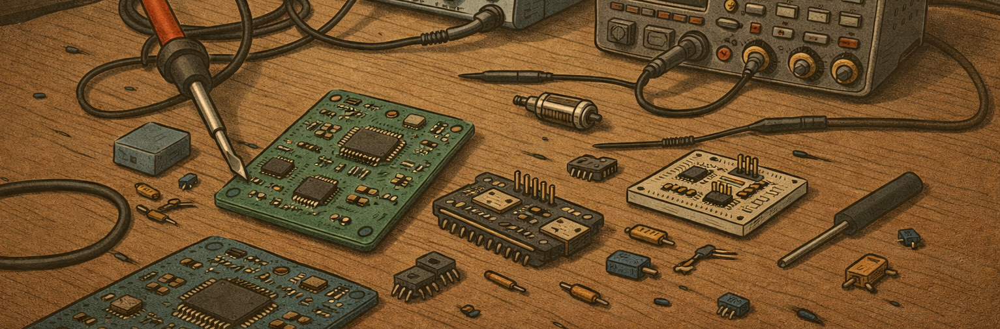

# 👋 Hi, I’m Guilherme Freire
> Embedded Electronics Engineer
- 🌱 I’m currently working in Embedded Systems at SENAI CIMATEC 
- 💞️ I’m looking to collaborate on RTOS and Embedded Machine Learning projects
- 📫 How to reach me: [linkedin](https://www.linkedin.com/in/guilherme-freire-de-almeida-44b02b187/)

 

  <h3> GitHub Stats </h3>
   
  
   
  
   
  
  

 

<!---
Freireg/Freireg is a ✨ special ✨ repository because its `README.md` (this file) appears on your GitHub profile.
You can click the Preview link to take a look at your changes.
--->
