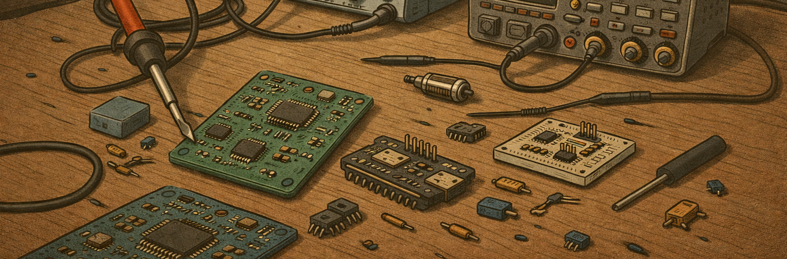

# 👋 Hi, I’m Guilherme Freire
> Embedded Software Engineer
- 🌱 I’m currently working at Toradex
- 💞️ I’m looking to collaborate on RTOS and Embedded Machine Learning projects
- 📫 How to reach me: [linkedin](https://www.linkedin.com/in/guilherme-freire-de-almeida-44b02b187/)

# 💻 Tech Stack:
 
 
 
 
 
 
 

 
# 📊 GitHub Stats:

 

  <h3> GitHub Stats </h3>
   
  
  

 

---

<!-- Proudly created with GPRM ( https://gprm.itsvg.in ) -->
